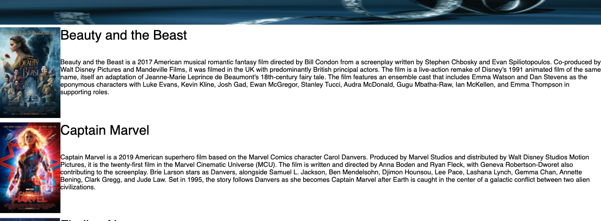

# Feedback Survey

## Description
*Duration: 2 days*

This app displays a list of movies. A user can click on a movie to go to a details page that shows the title, description, and genres of that movie. On the details page a user can click an edit button that allows the user to update the title and description of the movie selected. The user can also cancel the edit and click the back buttons to go back to the home screen.

## Screen Shot

## Prerequisites
- React
- Redux
- Postgres
- Node.js
- Axios
- Sagas

## Installation
1. Create a database named `saga_movies_weekend`,
2. The queries in `data.sql` will allow you to create the required tables to run the app properly. Postico is recommended to run the queries provided,
3. Open your chosen code editor and run `npm install`,
4. You will also want to run an `npm install` on react, redux, and react-redux,
5. Run `npm run server` in your terminal,
6. Open another terminal and run `npm run client`,

## Built With
- React
- Redux
- Javascript
- PostgreSQL
- HTML
- CSS

## Acknowledgement
Thank you  Prime Digital Academy for giving me the knowledge required to make this application.

## Support
For suggestions or issues, please email me at erick.jensen010@gmail.com
